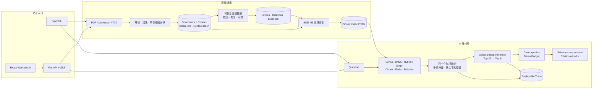

# Hybrid RAG Lab

一个以“可解释、可评测、可复现”为目标的 Hybrid / Graph / Agentic RAG 学习项目。

项目从文档导入开始，完整实现知识图谱抽取、三路检索、加权融合、cross-encoder 精排、引用约束、运行轨迹和人工审校 benchmark。重点不是堆叠框架或追求单一最高分，而是展示如何定义证据契约、设计公平评测，并解释系统收益与代价。

> 定位：方法论与工程实践作品，不是生产级通用知识库。

[Benchmark v2](docs/benchmark-v2.md) · [完整架构](docs/architecture.md) · [设计边界](docs/adr/001-build-vs-reuse.md)

## 结果先看

在 10 篇 RAG 论文、60 道人工审校题、Top-8 和同一 CUDA reranker 配置下，`mix` 与旧版 `naive` 的配对结果如下。旧版 `naive` 等价于现在的行业标准 `hybrid`（Dense + BM25）；相关性指标只聚合其中 50 道可回答题。该 benchmark 将按新命名重新运行，表中保留原始报告标签以避免篡改历史产物。

| 指标 | hybrid（旧报告：naive） | mix | mix - hybrid |
|---|---:|---:|---:|
| Exact-page Raw Recall@8 | 0.730 | 0.720 | -0.010 |
| Exact-page Context Recall@8 | 0.700 | 0.710 | +0.010 |
| Document Context Recall@8 | 0.880 | 0.950 | **+0.070** |
| Semantic Context Recall | 0.760 | 0.820 | **+0.060** |
| Context NDCG@8 | 0.635 | 0.655 | +0.020 |
| 平均延迟 | 2.951s | 3.344s | +0.393s |

在 10 道 multi-context 题上，`mix` 的优势更集中：

| 指标 | hybrid（旧报告：naive） | mix |
|---|---:|---:|
| Exact-page Raw Recall@8 | 0.050 | **0.150** |
| Document Context Recall@8 | 0.600 | **0.750** |
| Semantic Context Recall | 0.300 | **0.400** |

这个结果没有被包装成“mix 全面胜出”：强 reranker 会让高度重叠的候选池趋同，因此 `mix` 的价值主要体现在跨文档覆盖和最终交付上下文，而不是每道单跳题都提高精确页命中。完整配置、逐题胜负、离线 paired bootstrap 区间和局限见 [Benchmark v2](docs/benchmark-v2.md)。

运行环境：RTX 5070 Laptop GPU，`torch 2.13.0+cu130`，BGE-M3 embedding 使用 FP32，bge reranker 使用 FP16。本表对应的 retrieval-only 评测不调用外部 LLM，API 成本为 ¥0。

## 我在这个项目中解决了什么

- **七种清晰检索策略**：`dense`、`bm25` 与行业标准 `hybrid = dense + bm25` 可以直接消融；`graph_local`、`graph_global`、`graph_hybrid` 明确限定为图谱检索。
- **真正的融合排序**：组合模式按归一化后的显式权重合并候选，不再使用 round-robin；`mix = hybrid + graph_local + graph_global`。
- **复杂问题证据覆盖**：多跳路径可在有界范围内补充来源 chunk；显式比较问题会拆分子查询，并用跨文档 anchors 和 coverage-first context 避免第二侧证据被挤出。
- **本地模型链路**：BGE-M3 建立 chunk / entity / relation 三个索引分区，可选 bge-reranker-v2-m3 将 32 个候选精排为 Top-8；CUDA 可用时自动选择 GPU。
- **证据是一等数据**：回答只能引用实际读入 token budget 的原始 chunk；稳定 evidence ID、索引 profile、语料 hash 和 retrieval trace 支持审计与 replay。
- **有界 Agent**：Planner 只能选择项目定义的只读检索工具，受到 step、search、read 和并发预算约束；多上下文任务可分派给 2～3 个隔离 worker。
- **评测不是只看一个 Recall**：同时区分 raw candidates 与 delivered context，并报告 exact-page、document-level、semantic-evidence、延迟、成本和运行环境 provenance。

项目没有训练或微调 embedding、reranker、LLM，也没有执行网格搜索等系统化超参数优化；检索配置是固定的工程默认值。

## 架构



业务数据、索引 profile 与 trace 位于 workspace 级 SQLite；LangGraph checkpoint 使用独立 SQLite，只保存可恢复工作流状态。第三方库承担解析、持久化、编排和模型适配，稳定 ID、规范化、融合、预算、引用与评测契约由项目自身控制。

## 检索模式

| 模式 | 召回入口 | 适合问题 |
|---|---|---|
| `dense` | chunk dense vector | 纯语义检索基线 |
| `bm25` | deterministic BM25 | 纯关键词检索基线 |
| `hybrid` | dense + BM25 加权融合 | 行业标准 Hybrid Search |
| `graph_local` | entity vector → graph neighbors → source chunks | 实体、方法、数据集或局部关系 |
| `graph_global` | relation vector → graph paths → source chunks | 主题、关系、总结和全局问题 |
| `graph_hybrid` | graph_local + graph_global 加权融合 | 只使用图谱侧的组合检索 |
| `mix` | hybrid + graph_local + graph_global 加权融合 | 固定链路下的通用默认组合 |
| `agentic` | 有界 Planner 动态选择上述只读工具 | 需要分解、跨文档或迭代取证的问题 |

实体、关系和图路径只作为检索线索，最终 citation 必须回到原始 chunk。

## 5 分钟本地体验

需要 Python 3.11–3.13 和 [uv](https://docs.astral.sh/uv/)。以下流程使用仓库内两个小型 fixture，不需要 API key：

```bash
uv sync

uv run hrag ingest tests/fixtures/corpus --db storage/portfolio-demo.db

uv run hrag build-index --db storage/portfolio-demo.db

uv run hrag retrieve "How does dense retrieval differ from hybrid search?" --db storage/portfolio-demo.db --mode hybrid --json
```

首次建立索引会下载本地 `BAAI/bge-m3` 权重，不需要 embedding API key。Windows/Linux 默认安装 PyTorch CUDA 13.0 build；检测到兼容 GPU 时使用 CUDA，否则回退 CPU。macOS 使用普通 PyTorch build。

### 启用图谱与回答

复制 [.env.example](.env.example) 为 `.env`，配置 `DEEPSEEK_API_KEY` 后执行：

```bash
uv run hrag build-graph --db storage/portfolio-demo.db --limit 10

uv run hrag build-index --db storage/portfolio-demo.db

uv run hrag ask "How do graph routes complement chunk retrieval?" --db storage/portfolio-demo.db --mode agentic
```

图谱构建可中断恢复；命令会输出 run ID，之后可用 `hrag build-graph --resume <run-id>` 继续。

### 启动 Web 工作台

需要 [Bun](https://bun.sh/)：

```bash
# 终端 1：Python API
uv run hrag serve

# 终端 2：React/Vite UI
cd web
bun install --frozen-lockfile
bun run dev
```

在浏览器中创建 workspace，上传 PDF、Markdown 或 TXT，再按“导入文档 → 构建知识图谱 → 构建索引”执行。每个 workspace 拥有独立 uploads、业务数据库和 LangGraph checkpoint；DeepSeek key 只存在于 Python 进程，不会传给浏览器。

## 评测方法

v2 题集由 v1 的 60 道自动生成题逐题审计得到：21 道接受、39 道重写、0 道删除，最终包含：

- 30 道 single-hop
- 10 道 summary/reasoning
- 10 道 multi-context
- 10 道 unanswerable

评测固定 index profile 和 corpus hash，交替执行待比较模式，避免运行顺序偏差。指标分为三层：

1. **Exact-page**：是否命中人工指定的文档页/section evidence ID。
2. **Document-level**：是否覆盖目标文档，减少 chunk 边界对结果的干扰。
3. **Semantic-evidence**：检索上下文是否在语义上覆盖参考证据。

每层又区分 Raw Top-K 与 token budget 后真正交给回答器的 Delivered Context。60 题适合工程回归和学习项目展示，但不足以支持“全面显著领先”的强结论。

模式名称本身就是可配对的实验条件：`--modes dense,hybrid` 直接测量加入 BM25 的增量，`--modes hybrid,mix` 测量继续加入图谱路由后的增量；两组都可统一选择是否启用 reranker。

评测入口和复现配置见：

- [Benchmark v2：GPU、rerank、指标、结果与局限](docs/benchmark-v2.md)
- [机器可读结果摘要](docs/benchmark-v2-summary.json)
- [`scripts/evaluate_retrieval.py`](scripts/evaluate_retrieval.py)：无需外部 LLM 的 retrieval-only 配对评测
- [`scripts/curate_rag_benchmark.py`](scripts/curate_rag_benchmark.py)：v1 → v2 的确定性人工审计决策

论文原文、生成题集、SQLite 和大型 JSON trace 属于本地实验产物，由 Git 忽略；仓库保留评测代码、方法、机器可读结果摘要和产物 SHA-256。因此 fresh clone 可以在 fixture 或自有语料上复现评测流程，但不能仅凭公开仓库重建这次论文 benchmark 的完整逐题结果。

## 工程边界

- 支持带文本层的 PDF、Markdown 和 TXT；不包含扫描件 OCR。
- DeepSeek 只用于可选的图谱抽取、Planner、证据约束回答和 Ragas judge；embedding 与 reranking 均可本地运行。
- 默认关闭 cross-encoder reranker，方便 CPU 环境学习和调试；可在 `.env` 中启用 `flagembedding` provider。
- Web workspace 面向本地单用户演示，不以多租户生产部署为目标。
- Benchmark v2 是 retrieval-only；完整端到端答案质量仍需在明确模型、预算和语料版本下单独评测。

## 项目结构

```text
src/hybrid_rag/
├── ingest/       # loader、清洗、章节感知分块与稳定 ID
├── extraction/   # 图谱抽取、校验、修复与规范化
├── retrieval/    # Dense、BM25、图谱召回、融合、rerank 与 trace
├── agentic/      # 有界 Planner、worker、工具与审计事件
├── evaluation/   # evidence contract、retrieval metrics 与 Ragas
├── storage/      # SQLite repository 与 migrations
├── runtime.py    # FastAPI 工作台共享的模型与服务工厂
└── web_api.py    # React/TypeScript 工作台的 HTTP + SSE 边界

web/              # React + TypeScript + Vite 工作台
scripts/          # 语料准备、题集审计和 benchmark 入口
docs/              # 架构、ADR 与实验报告
```

## 延伸阅读

- [完整架构与持久化边界](docs/architecture.md)
- [Benchmark v1：问题是怎样暴露出来的](docs/benchmark-v1.md)
- [Benchmark v2：改造后的真实收益与代价](docs/benchmark-v2.md)
- [ADR 001：自研与复用边界](docs/adr/001-build-vs-reuse.md)
- [ADR 002：图谱抽取与恢复语义](docs/adr/002-graph-extraction-checkpoints.md)
- [ADR 003：索引、失效与 trace](docs/adr/003-retrieval-index-and-trace.md)
