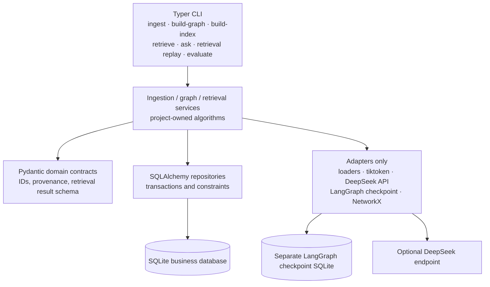
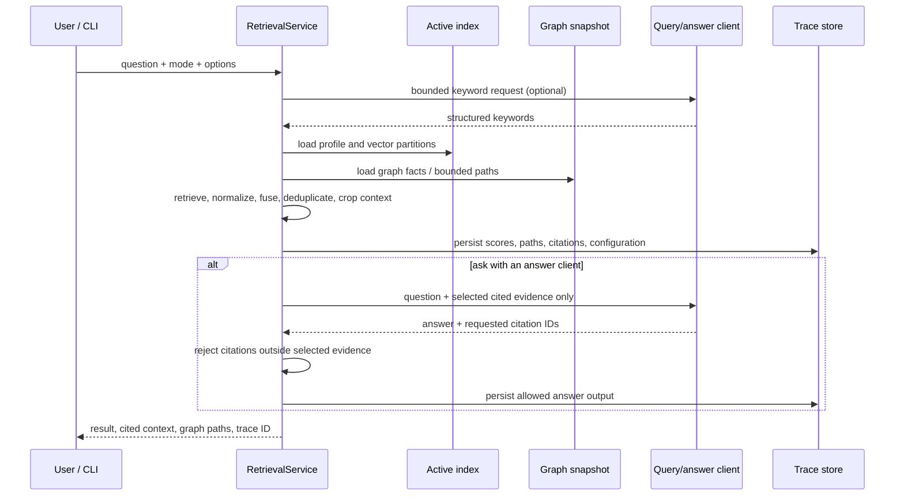
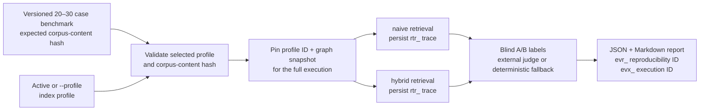

# Hybrid RAG architecture

> Status: this is the implemented Phase 1--4 architecture.  Phase 4 uses the
> same contracts for evaluation and demonstration; it does not introduce a
> second retrieval algorithm or an autonomous tool-using agent.

The project owns the domain contracts and the retrieval decisions.  Third-party
libraries are confined to adapters: PDF parsing, token counting, SQLAlchemy and
Alembic persistence, LangGraph checkpointing, NetworkX projection, and the
opt-in DeepSeek API client.

## End-to-end data flow

```mermaid
flowchart LR
    subgraph Ingest[Phase 1: reproducible ingestion]
        Files["PDF / Markdown / TXT"] --> Loaders["LoaderRegistry"]
        Loaders --> Parsed["ParsedDocument"]
        Parsed --> Clean["Conservative cleaner"]
        Clean --> Chunk["Section-aware, token-bounded chunker"]
        Chunk --> Corpus[("SQLite: documents + chunks")]
    end

    subgraph Graph[Phase 2: extraction and graph]
        Corpus --> Pending["Load pending chunks"]
        Pending --> Orchestrator["LangGraph parent + per-chunk subgraphs"]
        Orchestrator --> Extract["DeepSeek adapter\nJSON mode; thinking disabled"]
        Extract --> Validate["Pydantic validation\nempty-output checks"]
        Validate -->|invalid; bounded| Repair["Repair / retry"]
        Repair --> Validate
        Validate -->|optional| Review["Human review"]
        Validate --> Normalize["Project-owned normalization"]
        Review --> Normalize
        Normalize --> Merge["Project-owned relation merge"]
        Merge --> GraphStore[("SQLite: extraction attempts,\nentities, relations, evidence")]
        GraphStore --> NX["NetworkX MultiDiGraph projection"]
    end

    subgraph Index[Phase 3: independent index partitions]
        Corpus --> Snapshot["Source snapshot"]
        GraphStore --> Snapshot
        Snapshot --> Texts["Chunk / entity / relation\nembedding text"]
        Texts --> Embed["Embedding adapter\ndefault: local BGE-M3 (FlagEmbedding)"]
        Embed --> Vectors[("SQLite: embedding profiles\nand vector rows")]
    end

    subgraph Query[Phase 3: bounded retrieval and answer]
        Question["Question"] --> Keywords["Deterministic keywords\nor bounded DeepSeek keyword extraction"]
        Keywords --> Routes
        Vectors --> Routes
        NX --> Routes
        Routes{"Selected route"}
        Routes --> Naive["naive: chunk dense + BM25"]
        Routes --> Local["local: entity vectors + graph"]
        Routes --> Global["global: relation vectors + graph"]
        Routes --> Hybrid["hybrid: run all three\nin parallel"]
        Naive --> Fusion["Score normalization, weighted fusion,\ndeduplication and graph expansion"]
        Local --> Fusion
        Global --> Fusion
        Hybrid --> Fusion
        Fusion --> Rerank["Optional post-fusion reranker\nTop-M → final Top-K"]
        Rerank --> Context["Token-budget context selection"]
        Context --> Evidence["Cited context + graph paths"]
        Evidence --> Answer["Deterministic answer or bounded\nDeepSeek answer from supplied evidence only"]
        Evidence --> Trace[("SQLite: serializable\nretrieval trace")]
        Answer --> Trace
    end
```

`naive`, `local`, and `global` can be selected independently.  `naive` ranks
chunk candidates with dense vector and deterministic local BM25 lexical scores,
normalizes each subscore independently, and records its raw/normalized/weighted
components in the trace. After a selected mode's route fusion, the default
`BAAI/bge-reranker-v2-m3` reranker runs a local FlagEmbedding cross-encoder over
each `[query, passage]` pair and records its raw logit plus sigmoid-normalized
score. Set its provider to `none` to retain first-stage order.
`hybrid` is not a fourth opaque vector store: it runs the three route
calculations in parallel, then applies the same owned fusion, rerank, and
context-selection rules.

## Persistent ownership and invalidation

| Data | Owner | Why it is persisted |
| --- | --- | --- |
| Documents and chunks | ingestion pipeline | Stable source IDs, content hashes, parser/chunker provenance, and transactional replacement. |
| Extraction attempts and build items | graph pipeline | Bounded-call accounting, resumability, failed-sample inspection, and review state. |
| Canonical entities, relations, and evidence | graph pipeline | Source chunk IDs and evidence text remain attached to graph facts. |
| Embedding profiles and vectors | index builder | Each partition has its own embedding text; the profile binds provider, model, dimension, text schema, and source snapshot. |
| Retrieval traces | retrieval service | A mode, configuration, scores, paths, selected context, and optional answer can be serialized and replayed. |

The active index is valid only for the corpus and graph snapshot named by its
profile.  Its identity includes the graph build run as well as semantic index
configuration and the graph-bound source snapshot; a separate corpus-content
hash records document/chunk identity without making a benchmark depend on a
particular graph build.  A document change invalidates affected active profiles instead of
silently searching stale vectors.  Historical traces retain the profile and
snapshot references needed for inspection; replay is an audit operation, not a
claim that a changed corpus would produce the same current answer.

## Module boundaries

The domain models do not inherit LangChain, LangGraph, Docling, or vector-store
types.  In particular, the vector-store adapter boundary can change after a
benchmark without changing the semantic rules for text construction, route
selection, score fusion, citation tracking, or trace format.

## Retrieval evidence contract

The answer client is never given a free tool list or authority to retrieve more
material.  DeepSeek is optional in this layer and is limited to structured query
keywords and an answer grounded in the already selected evidence.  Fixture tests
explicitly use the deterministic hash adapter for speed and repeatability; the
default local BGE-M3 model still needs a quality benchmark for any production use.

## Evaluation execution contract

The corpus-content hash only covers documents/chunks, so a fixed question set can
be reused after a graph rebuild.  The report still names the graph-bound index
snapshot and graph run, so results from different graph builds are never silently
combined. A failed external judge produces an `unknown` cost disclosure unless
complete verified usage and price evidence is available; locally executed BGE-M3
and hash profiles have no embedding API cost.

## Operational checkpoints

- `ingest` owns file-level isolation and transactional document/chunk updates.
- `build-graph` uses the business database as the fact source and a separate
  LangGraph checkpoint database only for orchestration state.
- `build-index` writes a complete profile and all three vector partitions before
  activation.
- `retrieve` returns an explainable retrieval result without requiring answer
  generation; `ask` adds an evidence-constrained answer.
- `retrieval replay` loads a persisted trace for audit.  It should be paired
  with the profile ID, configuration hashes, corpus manifest, and code commit
  in any evaluation report.
- `evaluate` validates the benchmark corpus against a pinned profile, persists
  an `rtr_` trace for each case/mode, and writes unique execution artifacts.

For the evaluation protocol and the distinction between fixture validation and
claims about real-paper quality, see [evaluation-report.md](evaluation-report.md).
