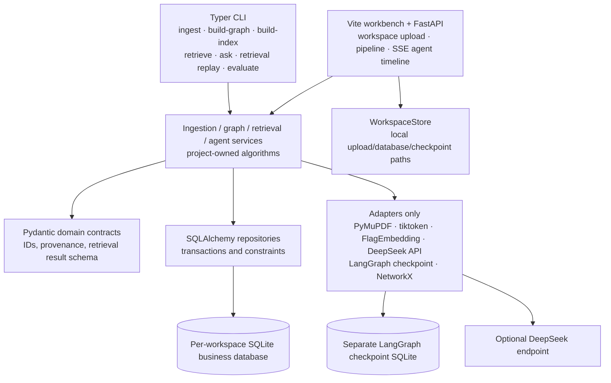
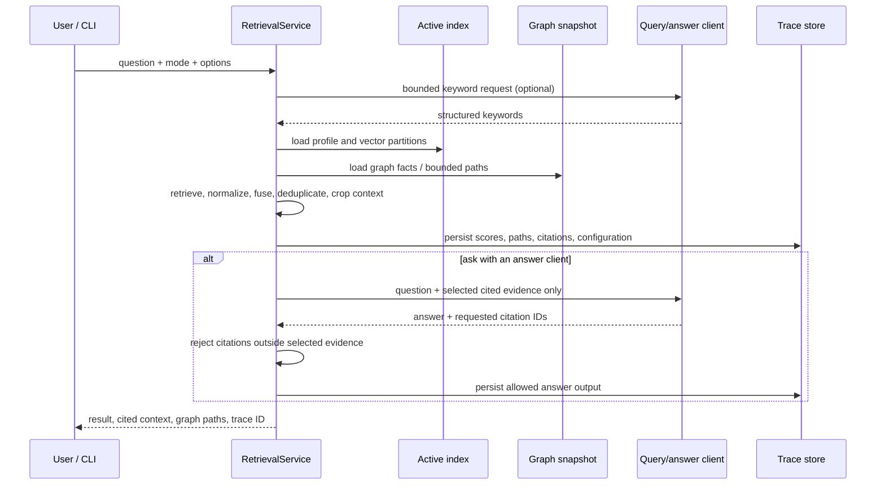
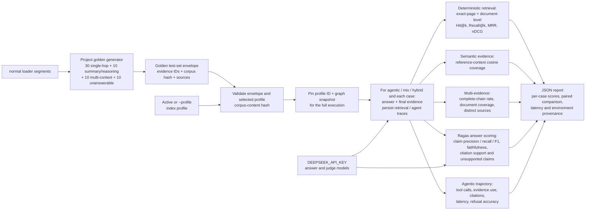

# Hybrid RAG Lab architecture

> Status: implemented architecture. The same persisted corpus, graph snapshot,
> index profile, and evidence contracts serve the CLI, web workbench, bounded
> agent loop, and Ragas evaluation.

The project owns the domain contracts and the retrieval decisions.  Third-party
libraries are confined to adapters: PyMuPDF parsing, token counting, SQLAlchemy
and Alembic persistence, LangGraph checkpointing, NetworkX projection,
FlagEmbedding, and the configurable DeepSeek API client. CLI `ask` and the web
workbench enable DeepSeek by default. The planner may select only
project-defined, budgeted retrieval tools or a bounded fork of two to three
independent search workers; it cannot invent tools or bypass the evidence
boundary.

## End-to-end data flow

```mermaid
flowchart LR
    subgraph Ingest[Reproducible ingestion]
        Files["PDF / Markdown / TXT"] --> Loaders["LoaderRegistry"]
        Loaders --> PDFSections["PDF sections: outline → tagged H1/H2/H3\n→ visual inference; no OCR"]
        PDFSections --> Parsed["ParsedDocument"]
        Loaders --> Parsed
        Parsed --> Clean["Conservative cleaner"]
        Clean --> Chunk["Section-aware, token-bounded chunker"]
        Chunk --> Quality["Persist quality class\nnormal / references / acknowledgements /\ncopyright / author affiliation / visualization label"]
        Quality --> Corpus[("SQLite: all documents + chunks")]
    end

    subgraph Graph[Extraction and graph]
        Corpus --> NormalGraph["Select quality_class = normal"]
        NormalGraph --> Pending["Load pending chunks"]
        Pending --> Orchestrator["LangGraph parent + per-chunk subgraphs"]
        Orchestrator --> Extract["DeepSeek adapter\nopen entity types + controlled JSON;\nthinking disabled"]
        Extract --> Validate["Local JSON repair + per-record Pydantic validation\nevidence checks; salvage valid records"]
        Validate -->|invalid; second call| Repair["Reason-aware semantic repair"]
        Repair --> RepairValidate["Validate repaired response"]
        Validate -->|valid; second call| Glean["Independent auditable glean\npreserve baseline + add omissions"]
        Glean --> GleanGate["Validate + baseline-preservation gate"]
        GleanGate -->|valid superset| Accepted["Accepted extraction"]
        GleanGate -->|invalid or regressive| Baseline["Fallback to validated baseline"]
        Baseline --> Accepted
        Validate -->|no glean budget| Accepted
        RepairValidate -->|valid| Accepted
        RepairValidate -->|invalid| Failed["Audited chunk failure"]
        Accepted -->|optional| Review["Human review"]
        Accepted --> Normalize["Project-owned normalization"]
        Review --> Normalize
        Normalize --> Merge["Project-owned relation merge"]
        Merge --> GraphStore[("SQLite: extraction attempts,\nentities, relations, evidence")]
        GraphStore --> NX["NetworkX MultiDiGraph projection"]
    end

    subgraph Index[Independent index partitions]
        Corpus --> NormalIndex["Select quality_class = normal"]
        NormalIndex --> Snapshot["Source snapshot"]
        GraphStore --> Snapshot
        Snapshot --> Texts["Chunk / entity / relation\nembedding text"]
        Texts --> Embed["Embedding adapter\ndefault: local BGE-M3 (FlagEmbedding)"]
        Embed --> Vectors[("SQLite: embedding profiles\nand vector rows")]
    end

    subgraph Query[Bounded retrieval and answer]
        Question["Question"] --> Keywords["Deterministic keywords\nor bounded DeepSeek keyword extraction"]
        Keywords --> Routes
        Vectors --> Routes
        NX --> Routes
        Routes{"Selected route"}
        Routes --> Dense["dense: chunk vectors"]
        Routes --> BM25["bm25: lexical scores"]
        Routes --> Hybrid["hybrid: dense + BM25"]
        Routes --> GraphLocal["graph_local: entity vectors + graph"]
        Routes --> GraphGlobal["graph_global: relation vectors + graph"]
        Routes --> GraphHybrid["graph_hybrid: graph_local + graph_global"]
        Routes --> Mix["mix: hybrid + graph_local + graph_global\nweighted score fusion (fixed-route default)"]
        Dense --> Fusion["Score normalization, weighted fusion,\ndeduplication, graph-path injection\nand multi-context coverage"]
        BM25 --> Fusion
        Hybrid --> Fusion
        GraphLocal --> Fusion
        GraphGlobal --> Fusion
        GraphHybrid --> Fusion
        Mix --> Fusion
        Fusion --> Rerank["Optional post-fusion reranker\nTop-M → final Top-K"]
        Rerank --> Context["Coverage-first token-budget\ncontext selection"]
        Context --> Evidence["Cited context + graph paths"]
        Evidence --> Answer["Deterministic answer or bounded\nDeepSeek answer from supplied evidence only"]
        Evidence --> Trace[("SQLite: serializable\nretrieval trace")]
        Answer --> Trace
    end

    subgraph Agent[Bounded planner loop (CLI/Web default)]
        AgentQuestion["Question + pinned profile + budgets"] --> Planner["DeepSeek planner by default"]
        Planner --> Fork["optional fork_search\n2-3 isolated workers"]
        Fork --> Tools["search chunks/entities/relations"]
        Planner --> Tools2["serial expand graph · read evidence"]
        Tools --> Planner
        Tools2 --> Planner
        Planner --> AgentAnswer["answer_from_evidence\ncitations limited to session-read chunks"]
        AgentAnswer --> Audit[("SSE timeline + JSON audit report")]
    end

    Vectors --> Tools
    NX --> Tools
```

PDF parsing intentionally targets documents with a text layer. It prefers the
document outline, otherwise Tagged PDF `H1/H2/H3`, and only then conservative
visual inference. Visual candidates exclude tables, repeated page margins,
numeric/scientific labels, dates, arXiv identifiers, copyright notices, and
low-alphabetic-content text. `Acknowledgements` and `References` receive an
additional exact semantic-heading pass because many paper outlines omit terminal
sections. Scanned PDFs require a future OCR-capable adapter.

Ingestion never discards a chunk. The deterministic quality classifier is part
of the chunking configuration and persists one `quality_class` on every row.
Graph extraction and chunk embedding consume only `normal` rows, while the full
document and all chunks remain available for provenance and reclassification.

Graph extraction follows LightRAG's open-type, controlled-format approach.
Entity types are normalized to `UPPER_SNAKE_CASE` strings rather than a closed
enum. Malformed JSON is repaired locally where possible; invalid individual
entities and relations are dropped without paying for another model call. With
the default two-call budget, a valid initial extraction receives one independent,
auditable `glean` pass, while a whole-response failure spends the second call on
reason-aware semantic repair instead; `repair` and `glean` are mutually exclusive.
The glean response is a complete candidate result and is accepted only if it
passes validation and preserves every baseline entity, relation, and evidence;
otherwise the validated baseline remains the result. Canonical entity identity
does not include type; merged names/aliases choose the most frequent observed
type, with stable lexical tie-breaking. Graph summaries count isolated entities
but materialization does not delete them solely for having no edge: entity-vector
retrieval can still map them directly to their source chunks.

`dense` and `bm25` are independent chunk-retrieval baselines. The industry-standard
`hybrid` strategy combines them, normalizes each subscore independently, and
records its raw/normalized/weighted components in the trace. `graph_local` starts
from entity vectors; `graph_global` starts from relation vectors. After a selected
strategy's route fusion, the optional
`BAAI/bge-reranker-v2-m3` reranker can run a local FlagEmbedding cross-encoder
over each `[query, passage]` pair and record its raw logit plus
sigmoid-normalized score. Its provider defaults to `none`, retaining first-stage
order unless explicitly enabled.
`graph_hybrid` combines only `graph_local + graph_global`, normalizes each route
independently, and ranks chunks by their explicit weighted fused score. `mix`
remains the default fixed-route composite strategy and combines
`hybrid + graph_local + graph_global`. Positive paths of at least two hops may
inject a bounded number of source chunks. Explicit comparison queries are split into aspect subqueries;
distinct-document anchors survive optional reranking and receive priority during
token-budget context assembly.

## Persistent ownership and invalidation

| Data | Owner | Why it is persisted |
| --- | --- | --- |
| Workspace metadata and uploads | web workbench | Filesystem isolation gives each workspace its own uploads, business database, and graph checkpoint. |
| Documents and chunks | ingestion pipeline | Stable source IDs, content hashes, parser/chunker provenance, persisted quality class, and transactional replacement. |
| Extraction attempts and build items | graph pipeline | Bounded-call accounting, resumability, failed-sample inspection, and review state. |
| Canonical entities, relations, and evidence | graph pipeline | Source chunk IDs and evidence text remain attached to graph facts. |
| Embedding profiles and vectors | index builder | Each partition has its own embedding text; the profile binds provider, model, dimension, text schema, and source snapshot. |
| Retrieval traces | retrieval service | A mode, configuration, scores, paths, selected context, and optional answer can be serialized and replayed. |
| Agent run reports | agent runner | The bounded planner timeline, tool outcomes, evidence, budgets, and termination reason remain auditable as JSON. |

The active index is valid only for the corpus and graph snapshot named by its
profile.  Its identity includes the graph build run as well as semantic index
configuration and the graph-bound source snapshot; a separate corpus-content
hash records document/chunk identity without making a Ragas test set depend on a
particular graph build.  A document change invalidates affected active profiles instead of
silently searching stale vectors.  Historical traces retain the profile and
snapshot references needed for inspection; replay is an audit operation, not a
claim that a changed corpus would produce the same current answer.

## Module boundaries



The domain models do not inherit LangChain, LangGraph, Docling, or vector-store
types.  In particular, the vector-store adapter boundary can change after an
evaluation without changing the semantic rules for text construction, route
selection, score fusion, citation tracking, or trace format.

## Retrieval evidence contract



The answer client is never given a free tool list or authority to retrieve more
material.  DeepSeek is optional in this layer and is limited to structured query
keywords and an answer grounded in the already selected evidence.  Fixture tests
explicitly use the deterministic hash adapter for speed and repeatability; the
default local BGE-M3 model still needs a corpus-bound Ragas evaluation before any
production use.

The CLI `ask` and web workbench default to the agent runner, which adds a planner,
not an unrestricted agent runtime. A
run pins one ready profile and enforces maximum steps, searches, graph
expansions, hops, evidence reads, evidence chunks, and evidence tokens. Search
tools apply the configured optional cross-encoder reranker before exposing
candidate chunks to the planner. Graph expansion and evidence reads accept only
IDs already discovered in the same session. `answer_from_evidence` can use and
cite only chunks explicitly read in that session. Duplicate normalized actions
are rejected, events stream to the web client, and the complete run is written
as an audit report. For multi-aspect or cross-document questions, `fork_search`
creates two to three isolated read-only worker sessions that share the pinned
profile, execute independent chunk/entity/relation searches concurrently, and
merge candidates into the main session in deterministic task order. Dependent
graph expansion, evidence reading, and answering remain serial barriers. Agent
searches use `persist=False`; the run audit is the single durable trajectory.

## Evaluation execution contract



The project generator, rather than Ragas TestsetGenerator, resolves the requested
corpus hash to a ready SQLite profile and reuses the exact `normal` chunks backing
that index. It enforces the configured question distribution and per-document
coverage, and validates controlled evidence references before writing schema v2.
Evidence IDs use document/page identities so ordinary chunk-size changes do not
invalidate the golden evidence mapping. Ragas remains the answer-quality judge
only.

Benchmark v2 also has a model-free answer path through
`scripts/evaluate_retrieval.py`. It skips answer generation and Ragas, alternates
the compared retrieval modes per case, and reports exact-page, document-level,
and semantic-evidence metrics for both raw Top-K candidates and the context that
survives token-budget assembly. It also reports complete-chain rate, document
coverage, and distinct source count. For exactly two modes, paired comparisons
include win/tie/loss rates, per-question-type deltas, and deterministic 95%
paired-bootstrap intervals. The report also records latency, package versions,
and accelerator provenance.

The test-set envelope is the only accepted evaluation input: its
`corpus_content_hash` must exactly equal the selected profile's graph-independent
document/chunk hash. This permits a test set to remain valid after a graph rebuild
only when the document/chunk corpus is unchanged; the persisted profile and trace
still disclose the graph-bound snapshot. `evaluate` requires `DEEPSEEK_API_KEY`
for the grounded answers and Ragas judges. DeepSeek estimates record the actual
response model plus cache-hit input, cache-miss input, and output tokens against
the configured CNY prices; locally executed BGE-M3 and hash profiles have no
embedding API cost.

## Operational checkpoints

- Alembic upgrades run before pipeline commands; schema `0007` rewrites historical
  trace names and payload keys once, then enforces only the current strategy names.
- `ingest` owns file-level isolation, PDF structure recovery, deterministic
  quality classification, and transactional document/chunk updates.
- `build-graph` uses the business database as the fact source and a separate
  LangGraph checkpoint database only for orchestration state. It schedules only
  `normal` chunks; after the initial call, the default budget permits either one
  semantic repair or one audited glean pass.
- `build-index` writes a complete profile and all three vector partitions before
  activation; its chunk partition includes only `normal` chunks.
- `retrieve` returns an explainable retrieval result without requiring answer
  generation; `ask` adds an evidence-constrained answer.
- The Agent planner receives lightweight chunk/entity/relation counts for its pinned
  profile. Tool descriptions explain their intended evidence shape and prerequisites,
  while the main planner remains free to select the route from the question and state.
- `retrieval replay` loads a persisted trace for audit.  It should be paired
  with the profile ID, configuration hashes, corpus manifest, and code commit
  in any evaluation report.
- `evaluate --testset` validates the golden envelope against a pinned profile,
  defaults to `agentic,mix,hybrid`, persists retrieval and agent traces, and writes
  deterministic retrieval, claim/citation/refusal answer metrics, and Agentic
  trajectory metrics. `--smoke`
  runs the same pipeline over a deterministic six-case stratified subset while
  preserving the original test-set case indexes in the report.
- `scripts/evaluate_retrieval.py` is the retrieval-only benchmark entry point. It
  does not require an answer or judge model and records exact-page, document,
  semantic-evidence, multi-evidence, paired-bootstrap, latency, and environment
  results for a pinned profile.
- The web workbench maps every request to one filesystem-isolated workspace;
  workspaces do not share uploads, business databases, or graph checkpoints.
