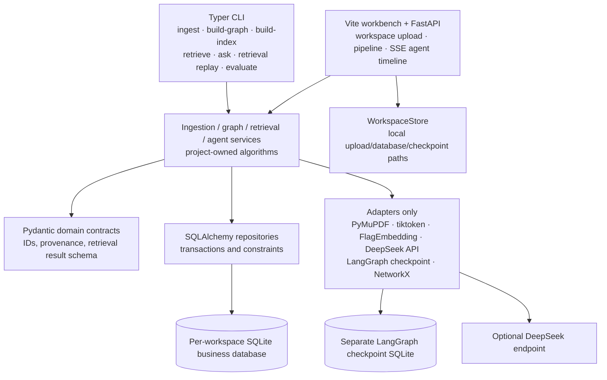
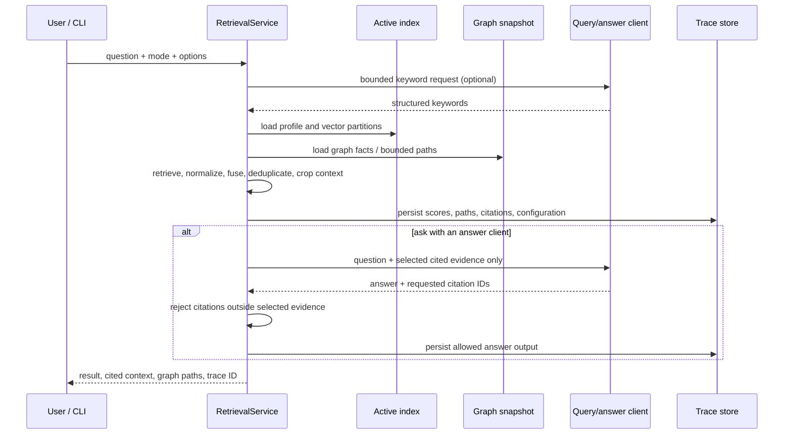
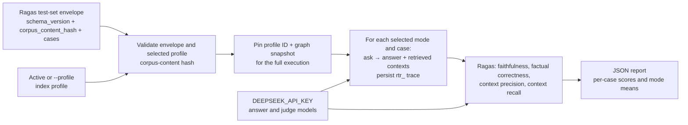

# Hybrid RAG Lab architecture

> Status: implemented architecture. The same persisted corpus, graph snapshot,
> index profile, and evidence contracts serve the CLI, web workbench, bounded
> agent loop, and Ragas evaluation.

The project owns the domain contracts and the retrieval decisions.  Third-party
libraries are confined to adapters: PyMuPDF parsing, token counting, SQLAlchemy
and Alembic persistence, LangGraph checkpointing, NetworkX projection,
FlagEmbedding, and the configurable DeepSeek API client. CLI `ask` and the web
workbench enable DeepSeek by default. The planner may select only
project-defined, budgeted retrieval tools; it cannot invent tools or bypass the
evidence boundary.

## End-to-end data flow

```mermaid
flowchart LR
    subgraph Ingest[Reproducible ingestion]
        Files["PDF / Markdown / TXT"] --> Loaders["LoaderRegistry"]
        Loaders --> PDFSections["PDF sections: outline → tagged H1/H2/H3\n→ visual inference; no OCR"]
        PDFSections --> Parsed["ParsedDocument"]
        Loaders --> Parsed
        Parsed --> Clean["Conservative cleaner"]
        Clean --> Chunk["Section-aware, token-bounded chunker"]
        Chunk --> Quality["Persist quality class\nnormal / references / acknowledgements /\ncopyright / author affiliation / visualization label"]
        Quality --> Corpus[("SQLite: all documents + chunks")]
    end

    subgraph Graph[Extraction and graph]
        Corpus --> NormalGraph["Select quality_class = normal"]
        NormalGraph --> Pending["Load pending chunks"]
        Pending --> Orchestrator["LangGraph parent + per-chunk subgraphs"]
        Orchestrator --> Extract["DeepSeek adapter\nopen entity types + controlled JSON;\nthinking disabled"]
        Extract --> Validate["Local JSON repair + per-record Pydantic validation\nevidence checks; salvage valid records"]
        Validate -->|whole-response failure; once| Repair["Reason-aware semantic repair"]
        Repair --> Validate
        Validate -->|optional| Review["Human review"]
        Validate --> Normalize["Project-owned normalization"]
        Review --> Normalize
        Normalize --> Merge["Project-owned relation merge"]
        Merge --> GraphStore[("SQLite: extraction attempts,\nentities, relations, evidence")]
        GraphStore --> NX["NetworkX MultiDiGraph projection"]
    end

    subgraph Index[Independent index partitions]
        Corpus --> NormalIndex["Select quality_class = normal"]
        NormalIndex --> Snapshot["Source snapshot"]
        GraphStore --> Snapshot
        Snapshot --> Texts["Chunk / entity / relation\nembedding text"]
        Texts --> Embed["Embedding adapter\ndefault: local BGE-M3 (FlagEmbedding)"]
        Embed --> Vectors[("SQLite: embedding profiles\nand vector rows")]
    end

    subgraph Query[Bounded retrieval and answer]
        Question["Question"] --> Keywords["Deterministic keywords\nor bounded DeepSeek keyword extraction"]
        Keywords --> Routes
        Vectors --> Routes
        NX --> Routes
        Routes{"Selected route"}
        Routes --> Naive["naive: chunk dense + BM25"]
        Routes --> Local["local: entity vectors + graph"]
        Routes --> Global["global: relation vectors + graph"]
        Routes --> Hybrid["hybrid: local + global\nround-robin fusion"]
        Routes --> Mix["mix: naive + local + global\nround-robin fusion (fixed-route default)"]
        Naive --> Fusion["Score normalization, weighted fusion,\ndeduplication and graph expansion"]
        Local --> Fusion
        Global --> Fusion
        Hybrid --> Fusion
        Mix --> Fusion
        Fusion --> Rerank["Optional post-fusion reranker\nTop-M → final Top-K"]
        Rerank --> Context["Token-budget context selection"]
        Context --> Evidence["Cited context + graph paths"]
        Evidence --> Answer["Deterministic answer or bounded\nDeepSeek answer from supplied evidence only"]
        Evidence --> Trace[("SQLite: serializable\nretrieval trace")]
        Answer --> Trace
    end

    subgraph Agent[Bounded planner loop (CLI/Web default)]
        AgentQuestion["Question + pinned profile + budgets"] --> Planner["DeepSeek planner by default"]
        Planner --> Tools["search chunks/entities/relations\nexpand graph · read evidence"]
        Tools --> Planner
        Planner --> AgentAnswer["answer_from_evidence\ncitations limited to session-read chunks"]
        AgentAnswer --> Audit[("SSE timeline + JSON audit report")]
    end

    Vectors --> Tools
    NX --> Tools
```

PDF parsing intentionally targets documents with a text layer. It prefers the
document outline, otherwise Tagged PDF `H1/H2/H3`, and only then conservative
visual inference. Visual candidates exclude tables, repeated page margins,
numeric/scientific labels, dates, arXiv identifiers, copyright notices, and
low-alphabetic-content text. `Acknowledgements` and `References` receive an
additional exact semantic-heading pass because many paper outlines omit terminal
sections. Scanned PDFs require a future OCR-capable adapter.

Ingestion never discards a chunk. The deterministic quality classifier is part
of the chunking configuration and persists one `quality_class` on every row.
Graph extraction and chunk embedding consume only `normal` rows, while the full
document and all chunks remain available for provenance and reclassification.

Graph extraction follows LightRAG's open-type, controlled-format approach.
Entity types are normalized to `UPPER_SNAKE_CASE` strings rather than a closed
enum. Malformed JSON is repaired locally where possible; invalid individual
entities and relations are dropped without paying for another model call. Only
a whole-response failure can trigger one semantic repair, whose prompt includes
the invalid response and concrete validation reasons. Canonical entity identity
does not include type; merged names/aliases choose the most frequent observed
type, with stable lexical tie-breaking.

`naive`, `local`, and `global` can be selected independently.  `naive` ranks
chunk candidates with dense vector and deterministic local BM25 lexical scores,
normalizes each subscore independently, and records its raw/normalized/weighted
components in the trace. After a selected mode's route fusion, the default
`BAAI/bge-reranker-v2-m3` reranker runs a local FlagEmbedding cross-encoder over
each `[query, passage]` pair and records its raw logit plus sigmoid-normalized
score. Set its provider to `none` to retain first-stage order.
`hybrid` is not a fourth opaque vector store: it runs only the `local` and
`global` graph routes in parallel, then interleaves their chunk candidates and
deduplicates by chunk ID. `mix` is the default fixed-route LightRAG-aligned composite mode:
it adds the project's `naive` chunk route and interleaves naive/local/global
candidates before the same rerank and context-selection rules. The project's
`naive` route retains local BM25 as an explicit extension beyond LightRAG's
vector-only naive mode.

## Persistent ownership and invalidation

| Data | Owner | Why it is persisted |
| --- | --- | --- |
| Workspace metadata and uploads | web workbench | Filesystem isolation gives each workspace its own uploads, business database, and graph checkpoint. |
| Documents and chunks | ingestion pipeline | Stable source IDs, content hashes, parser/chunker provenance, persisted quality class, and transactional replacement. |
| Extraction attempts and build items | graph pipeline | Bounded-call accounting, resumability, failed-sample inspection, and review state. |
| Canonical entities, relations, and evidence | graph pipeline | Source chunk IDs and evidence text remain attached to graph facts. |
| Embedding profiles and vectors | index builder | Each partition has its own embedding text; the profile binds provider, model, dimension, text schema, and source snapshot. |
| Retrieval traces | retrieval service | A mode, configuration, scores, paths, selected context, and optional answer can be serialized and replayed. |
| Agent run reports | agent runner | The bounded planner timeline, tool outcomes, evidence, budgets, and termination reason remain auditable as JSON. |

The active index is valid only for the corpus and graph snapshot named by its
profile.  Its identity includes the graph build run as well as semantic index
configuration and the graph-bound source snapshot; a separate corpus-content
hash records document/chunk identity without making a Ragas test set depend on a
particular graph build.  A document change invalidates affected active profiles instead of
silently searching stale vectors.  Historical traces retain the profile and
snapshot references needed for inspection; replay is an audit operation, not a
claim that a changed corpus would produce the same current answer.

## Module boundaries



The domain models do not inherit LangChain, LangGraph, Docling, or vector-store
types.  In particular, the vector-store adapter boundary can change after an
evaluation without changing the semantic rules for text construction, route
selection, score fusion, citation tracking, or trace format.

## Retrieval evidence contract



The answer client is never given a free tool list or authority to retrieve more
material.  DeepSeek is optional in this layer and is limited to structured query
keywords and an answer grounded in the already selected evidence.  Fixture tests
explicitly use the deterministic hash adapter for speed and repeatability; the
default local BGE-M3 model still needs a corpus-bound Ragas evaluation before any
production use.

The CLI `ask` and web workbench default to the agent runner, which adds a planner,
not an unrestricted agent runtime. A
run pins one ready profile and enforces maximum steps, searches, graph
expansions, hops, evidence reads, evidence chunks, and evidence tokens. Search
tools apply the configured optional cross-encoder reranker before exposing
candidate chunks to the planner. Graph expansion and evidence reads accept only
IDs already discovered in the same session. `answer_from_evidence` can use and
cite only chunks explicitly read in that session. Duplicate normalized actions
are rejected, events stream to the web client, and the complete run is written
as an audit report.

## Evaluation execution contract



The test-set envelope is the only accepted evaluation input: its
`corpus_content_hash` must exactly equal the selected profile's graph-independent
document/chunk hash. This permits a test set to remain valid after a graph rebuild
only when the document/chunk corpus is unchanged; the persisted profile and trace
still disclose the graph-bound snapshot. `evaluate` requires `DEEPSEEK_API_KEY`
for the grounded answers and Ragas judges. DeepSeek estimates record the actual
response model plus cache-hit input, cache-miss input, and output tokens against
the configured CNY prices; locally executed BGE-M3 and hash profiles have no
embedding API cost.

## Operational checkpoints

- Alembic upgrades run before pipeline commands; schema `0006` persists chunk
  quality without deleting source rows.
- `ingest` owns file-level isolation, PDF structure recovery, deterministic
  quality classification, and transactional document/chunk updates.
- `build-graph` uses the business database as the fact source and a separate
  LangGraph checkpoint database only for orchestration state. It schedules only
  `normal` chunks and limits semantic repair to one model call.
- `build-index` writes a complete profile and all three vector partitions before
  activation; its chunk partition includes only `normal` chunks.
- `retrieve` returns an explainable retrieval result without requiring answer
  generation; `ask` adds an evidence-constrained answer.
- `retrieval replay` loads a persisted trace for audit.  It should be paired
  with the profile ID, configuration hashes, corpus manifest, and code commit
  in any evaluation report.
- `evaluate --testset` validates the Ragas envelope against a pinned profile,
  persists an `rtr_` trace for each case/mode, and writes a JSON report.
- The web workbench maps every request to one filesystem-isolated workspace;
  workspaces do not share uploads, business databases, or graph checkpoints.
